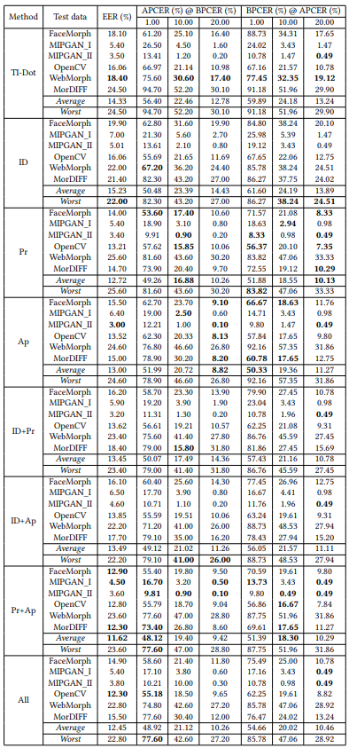

# This is the official repository of the paper "MADPromptS: Unlocking Zero-Shot Morphing Attack Detection with Multiple Prompt Aggregation" (accepted at the SVC Workshop, ACMMM 2025)

## Abstract

Face Morphing Attack Detection (MAD) is a critical challenge in face recognition security, where attackers can fool systems by interpolating the identity information of two or more individuals into a single face image, resulting in samples that can be verified as belonging to multiple identities by face recognition systems. While multimodal foundation models (FMs) like CLIP offer strong zero-shot capabilities by jointly modeling images and text, most prior works on FMs for biometric recognition have relied on fine-tuning for specific downstream tasks, neglecting their potential for direct, generalizable deployment. This work explores a pure zero-shot approach to MAD by leveraging CLIP without any additional training or fine-tuning, focusing instead on the design and aggregation of multiple textual prompts per class. By aggregating the embeddings of diverse prompts, we better align the model’s internal representations with the MAD task, capturing richer and more varied cues indicative of bona-fide or attack samples. Our results show that prompt aggregation substantially improves zero-shot detection performance, demonstrating the effectiveness of exploiting foundation models’ built-in multimodal knowledge through efficient prompt engineering.

## Results
### CLIP Zero-Shot Evaluation

## Datasets Download

TBR

## How to Run?

TBR

## Citation

TBR

## License

<pre>This project is licensed under the terms of the Attribution-NonCommercial 4.0 International (CC BY-NC 4.0) license. 
Copyright (c) 2025 Fraunhofer Institute for Computer Graphics Research IGD Darmstadt </pre>
